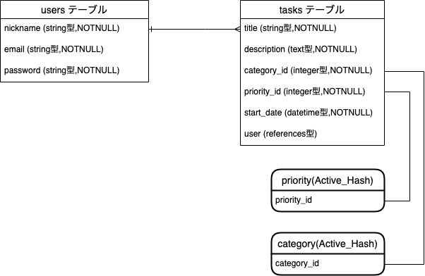

## DoCalendar
URL: https://docalendar-phalanx.herokuapp.com

Basic認証: ユーザー名: admin
          パスワード: 2222

## 概要
DoCalendarとはタスクカードとカレンダーを使用したToDo管理アプリケーションサービスです。

## 使用技術
- フレームワーク：Rails6.0.0
- フロント：css
- サーバーサイド言語：Ruby2.6.5
- データベース：MySQL
- コードチェック：RuboCop
- バージョン管理：GitHub
- デプロイ環境：heroku
- ユーザー管理：devise
- 検索絞込み機能：ransak
- カレンダー機能: simple_calendar
- 使用マシン：Mac Catalina(10.15.7)
- 開発期間（約 3 週間）

## 目指した課題解決

予定管理の観点から
- タスクだけのToDoアプリだと長期的な予定を管理するのが大変という課題への解決。
- 時間に追われていて緊急性があるタスクかどうかを視覚的に瞬時に見分ける必要があるという課題への解決。

## メイン機能

登録したユーザーは、タスクの作成・編集が行えます。

タブから今月のカレンダーを見ることができます。

- 当日は水色で、予定の入っている日は緑色で表示されます。

## サブ機能

- ゲストログイン機能
- タスク詳細確認機能
- タスク編集/削除機能
- タスク名検索機能
- タスク優先度絞り込み機能

## 追加実装予定

- タスク共有機能(複数のユーザーが同じ予定を共有する機能)
- タスクコメント機能(予定を共有するユーザー同士が疎通するための機能)

## こだわった点

- 優先度によってタスクの色が変更される点
- タブ機能を採用しカレンダーとタスクの確認を容易にした点

## DoCalendarのER図

## テーブル構成

## users テーブル

| Column             | Type        | Options                        |
| ------------------ | ----------- | ------------------------------ |
| email              | string      | null: false, unique: true      |
| encrypted_password | string      | null: false                    |
| nickname           | string      | null: false                    |

### Association
- has_many :tasks

## tasks テーブル

Column      | Type       | Options                        |
| ----------- | ---------- | ------------------------------ |
| title       | string     | null: false                    |
| description | text       | null: false                    |
| start_time  | datetime   | null: false                    |
| category_id | integer    | null: false                    |
| priority_id | integer    | null: false                    |
| user        | references | null: false, foreign_key: true |

### Association
- belongs_to user

## Active_hash
- category
- priority